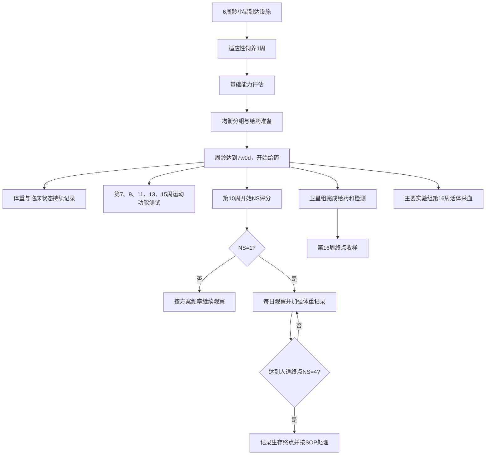

# SOD1G93A 渐冻症小鼠模型药效实验方案

## 结构化整理稿 v0.3

> 本文件根据 `方案文本版.txt` 进行章节重排、表格重建和流程结构化，仅作为方案核对稿，不替代原始审批文件。原文中无法确定或存在冲突的内容均保留在“待确认事项”中，未擅自修改为确定值。

**整理日期：** 2026-08-14  
**原始文件：** `方案文本版.txt`  
**方案有效期：** 原文记载至 2028-04-28  
**当前状态：** 已纳入本轮确认内容；后续检测项目保留为可编辑 TBD

## 0. 本轮已确认的关键规则

| 项目 | 本轮确认结果 |
|---|---|
| Test Article 命名 | Testing article-1 和 Testing article-2 均为 MTB-1967，仅给药浓度/剂量水平不同 |
| 利鲁唑剂量写法 | 8 mg/10 mL/kg |
| MTB-1967 剂量写法 | 200 mg/10 mL/kg、400 mg/10 mL/kg |
| 给药频次 | 全部给药每日一次（QD） |
| NS 评分频次 | 每周两次 |
| 给药时间窗口 | 动物周龄达到 7w0d 时开始，至 15w0d 时停止；间隔 8 周，即 56 天 |
| 载体保存 | 4°C 保存一周 |
| 是否需要额外造模 | 不需要；SOD1G93A 动物因基因型自行发病，不设置额外造模步骤 |
| 卫星组收样 | 血浆、CSF、腓肠肌、EDL（趾长伸肌）、腰椎脊髓 L3-L6；不取大脑 |
| WT 动物分配 | 原主要实验组 WT + Vehicle 共10只，其中5只转入卫星组 G1；主要实验组 G1 修正为5只 |
| 动物时间信息 | 7月20日出生；8月25日预计到达设施；预计到达时按项目约定记录为 W6 周龄 |

---

## 1. 实验概览

| 项目 | 整理后的内容 | 来源/备注 |
|---|---|---|
| 实验目的 | 通过生存率、体重、运动功能以及体外相关检测指标水平，评估受试物在渐冻症小鼠模型（SOD1G93A）中的药效作用 | 原文 1.1 |
| 疾病模型 | SOD1G93A 小鼠模型 | 原文 1.1 |
| 阴性对照 | B6SJL-WT 同窝对照小鼠 | 原文 2.2、2.5 |
| 主要评价方向 | 生存率、体重、神经功能评分、运动功能、后续体外/组织学指标 | 原文 1.1、5.8-5.15 |
| 合规性 | 实验方案已获得公司 IACUC 批准 | 原文 1.2 |
| 方案有效期 | 至 2028-04-28 | 原文 1.2 |
| 执行标准 | AAALAC 相关标准、公司内部技术要求和标准 | 原文 1.3、2.1 |
| 责任范围 | 对动物实验完整性、可追溯性、记录客观性和真实性负责 | 原文 1.4 |
| 主要实验组 | 探究生存率 | 原文 2.5.1 |
| 卫星组 | 提前终点收样，用于免疫荧光/组化检测 | 原文 2.5.2 |

### 1.1 初步实验流程

> 说明：SOD1G93A 动物因基因型自行发病，本方案不设置额外造模步骤；原文“分组造模”标题按本轮确认改为“均衡分组与给药准备”。

---

## 2. 实验动物与饲养条件

### 2.1 动物采购与数量

| 动物用途 | 种属 | 品系 | 周龄 | 性别 | 供应商 | 实验所需数量 | 实际订购数量 |
|---|---|---|---:|---|---|---:|---:|
| WT 对照及主要实验组 | 小鼠 | B6SJL-WT 对照小鼠；与 SOD1G93A 同窝 | 6周 | 雄性 | 赛业（苏州）生物科技有限公司 | 10 | 10 |
| SOD1G93A 模型动物 | 小鼠 | B6SJL-SOD1G93A 小鼠 | 6周 | 雄性 | 赛业（苏州）生物科技有限公司 | 68 | 68 |
| **合计** |  |  |  |  |  | **78** | **78** |

**原文特殊要求：** 无。  
**标记方法：** 耳标法。  
**出生日期：** 7月20日。  
**预计到达设施日期：** 8月25日。  
**预计到达周龄：** 按项目约定记录为 W6 周龄；实际到达日期和时间到货后填写。  
**到达后处理：** 适应性饲养 1 周后，根据体重、后肢抓力、疲劳转棒和平衡木基础能力进行综合判断并均衡分组。

### 2.2 动物福利与设施条件

| 项目 | 条件 |
|---|---|
| 温度 | 20-25°C |
| 相对湿度 | 40-70% |
| 光照周期 | 12 小时光照，07:00-19:00 |
| 每笼动物数量 | 5 只/笼 |
| 饮食 | 自由采食 |
| 饮水 | 自由饮水 |
| 垫料 | 玉米芯 |
| 动物玩具 | 塑料圆管 |
| 适用 SOP | SOP-SHACU-AF-008-1.0《大小鼠饲养管理》 |
| 动物安乐死 | SOP-VET-008-4.0《实验动物安乐死》 |

### 2.3 动物数量核对

#### 主要实验组

| 组别 | 动物组名 | 动物数量 |
|---:|---|---:|
| 1 | WT + Vehicle | 5 |
| 2 | Model + Vehicle | 12 |
| 3 | Model + Riluzole | 12 |
| 4 | Model + MTB-1967（200） | 12 |
| 5 | Model + MTB-1967（400） | 12 |
|  | **主要实验组小计** | **53** |

#### 卫星组

| 组别 | 动物组名 | 动物数量 | 数量关系 |
|---:|---|---:|---|
| 1 | WT + Vehicle | 5 | 由原主要实验组 WT + Vehicle 中转入；转入后不再计入主要实验组 G1 |
| 2 | Model + Vehicle | 5 | 新增 SOD1G93A |
| 3 | Model + Riluzole | 5 | 新增 SOD1G93A |
| 4 | Model + MTB-1967（200） | 5 | 新增 SOD1G93A |
| 5 | Model + MTB-1967（400） | 5 | 新增 SOD1G93A |
|  | **卫星组记录总数** | **25** | 其中 5 只 WT 与主要实验组重复引用 |

#### 总动物数推导

| 项目 | 数量 |
|---|---:|
| 主要实验组独立动物数 | 53 |
| 卫星组新增模型动物数 | 20 |
| 卫星组转入 WT 数 | 5 |
| 独立动物总数 | **78** |

> 采购数量仍为 10 只 WT 和 68 只 SOD1G93A。按本轮确认，10 只 WT 中5只进入主要实验组 G1，另外5只转入卫星组 G1；主要实验组独立动物数为53，卫星组独立动物数为25，合计78只。

---

## 3. 实验分组与给药方案

### 3.1 主要实验组：生存率研究

| 组号 | 动物组名 | Test Article / Vehicle | 数量 | 原文剂量与给药方案 | 给药途径 | 主要体内实验安排 |
|---:|---|---|---:|---|---|---|
| 1 | WT + Vehicle | Vehicle | 5 | 10 mL/kg，QD | PO | 第7、9、11、13、15周检测后肢抓力、疲劳转棒和平衡木；第10周开始 NS；第16周主要实验组活体采血 |
| 2 | Model + Vehicle | Vehicle | 12 | 10 mL/kg，QD | PO | 同上；主要终点为生存率 |
| 3 | Model + Riluzole | 利鲁唑 | 12 | 8 mg/10 mL/kg，QD | PO | 同上；主要终点为生存率 |
| 4 | Model + MTB-1967（Testing article-1） | MTB-1967 | 12 | 200 mg/10 mL/kg，QD | PO | 同上；主要终点为生存率 |
| 5 | Model + MTB-1967（Testing article-2） | MTB-1967 | 12 | 400 mg/10 mL/kg，QD | PO | 同上；主要终点为生存率 |

### 3.2 卫星组：提前终点收样

| 组号 | 动物组名 | Test Article / Vehicle | 数量 | 原文剂量与给药方案 | 给药途径 | 终点安排 |
|---:|---|---|---:|---|---|---|
| 1 | WT + Vehicle（由原主要实验组转入） | Vehicle | 5 | 10 mL/kg，QD | PO | 第16周终点收样 |
| 2 | Model + Vehicle | Vehicle | 5 | 10 mL/kg，QD | PO | 第16周终点收样 |
| 3 | Model + Riluzole | 利鲁唑 | 5 | 8 mg/10 mL/kg，QD | PO | 第16周终点收样 |
| 4 | Model + MTB-1967（Testing article-1） | MTB-1967 | 5 | 200 mg/10 mL/kg，QD | PO | 第16周终点收样 |
| 5 | Model + MTB-1967（Testing article-2） | MTB-1967 | 5 | 400 mg/10 mL/kg，QD | PO | 第16周终点收样 |

### 3.3 已确认的剂量和频次写法

按本轮确认，页面和整理稿统一采用以下写法：

- 利鲁唑：8 mg/10 mL/kg，PO，QD。
- MTB-1967 低剂量组：200 mg/10 mL/kg，PO，QD。
- MTB-1967 高剂量组：400 mg/10 mL/kg，PO，QD。
- Testing article-1 和 Testing article-2 均指 MTB-1967，区分依据为给药浓度/剂量水平，不是两种不同化合物。
- 载体组：10 mL/kg，PO，QD。

页面数据字段统一为：

| 字段 | 示例 | 状态 |
|---|---|---|
| Target dose | 8、200 或 400 | 已确认 |
| Dose expression | mg/10 mL/kg | 已确认，按方案原始表达保存 |
| Dose volume | 10 mL/kg | 已确认 |
| Frequency | QD | 已确认 |
| Route | PO | 已确认 |

---

## 4. 待测化合物、溶剂及配制记录

### 4.1 待测化合物来源

| 待测化合物 | 来源 | 批号 |
|---|---|---|
| 利鲁唑口服混悬液 | Italfarmaco | 原文未提供 |
| Testing article-1 / MTB-1967（200 mg/10 mL/kg） | 上海杜诺生物医药有限公司 | PWH01078-63-FP-P1 |
| Testing article-2 / MTB-1967（400 mg/10 mL/kg） | 上海杜诺生物医药有限公司 | 原文未单独提供；需确认是否与 Testing article-1 共用批号 |

> 本轮已确认：Testing article-1 和 Testing article-2 均为 MTB-1967，仅对应不同给药浓度/剂量水平。

### 4.2 性状、浓度/纯度和储存条件

| 待测化合物 | 直观描述 | 浓度/纯度 | 储存条件 |
|---|---|---|---|
| 利鲁唑口服混悬液 | 溶液 | 1.5 g/300 mL；折算为 5 mg/mL | 室温（<25°C） |
| MTB-1967 | 固体粉末 | 99.3% | 室温 |

### 4.3 安全信息

| 待测化合物名称 | 相关安全信息 |
|---|---|
| 利鲁唑 | NA |
| MTB-1967 | 待确认 |

### 4.4 溶剂/载体

| 待测化合物 | 溶剂/载体 |
|---|---|
| 利鲁唑口服混悬液 | 0.5%（w/v）CMC-Na 水溶液，含 0.2%（v/v）Tween-80 |
| MTB-1967 | 0.5%（w/v）CMC-Na 水溶液，含 0.2%（v/v）Tween-80 |

### 4.5 载体溶液配制

| 项目 | 原文内容 |
|---|---|
| 配制频率 | 每周配制 |
| 每批体积 | 250 mL |
| CMC-Na 用量 | 1.25 g |
| Tween-80 用量 | 0.5 mL |
| 定容 | 至 250 mL |
| 混匀 | 充分混匀 |
| 过滤 | 0.22 μm 滤器过滤除菌 |
| 保存 | 4°C 保存一周 |

### 4.6 利鲁唑工作液配制

#### 原文计算链

| 步骤 | 内容 |
|---:|---|
| 1 | 利鲁唑口服原液：1.5 g/300 mL/瓶，即 1500 mg/300 mL，浓度 5 mg/mL |
| 2 | 目标给药剂量：8 mg/10 mL/kg，给药体积 10 mL/kg |
| 3 | 取 1 mL 利鲁唑原液，含利鲁唑 5 mg |
| 4 | 加入 5.25 mL 0.5% CMC-Na-0.2% Tween-80 |
| 5 | 总体积 6.25 mL，涡旋振荡混匀 |
| 6 | 由计算可得工作液浓度约为 0.8 mg/mL；按 10 mL/kg 给药可达到 8 mg/kg |
| 7 | 使用前平衡至室温，给药前再次充分振荡，按体重给药 |

#### 使用量与有效期

| 项目 | 原文内容 |
|---|---|
| 每日配制量 | 6.25 mL |
| 适用量估算 | 约 17 只、每只体重约 33.5 g 的小鼠，已考虑合理损耗 |
| 开瓶后有效期 | 开瓶 15 日后剩余药液视为过期/失效，丢弃剩余药液 |
| 预计用量 | 给药 8 周，需消耗 4 瓶利鲁唑混悬液 |

### 4.7 MTB-1967 工作液配制

#### 总用量估算

| 项目 | 原文计算 |
|---|---|
| 每日估算 | 30 g/只 × 17 只/组 × 1 组 ×（200 + 400 μg/g）× 120% 损耗 = 367 mg |
| 每周估算 | 367 mg × 7 = 2.57 g |
| 给药 8 周 | 20.5 g |
| 给药 9 周 | 23.1 g |

#### 400 mg/10 mL/kg 给药组工作液（原文写作 400 mpk）

| 步骤 | 内容 |
|---:|---|
| 1 | 称取 360 mg MTB-1967，加入研钵 |
| 2 | 加入 1 mL 0.5% CMC-Na-0.2% Tween-80，轻柔充分研磨 |
| 3 | 少量多次加入载体，转移至量筒 |
| 4 | 新增纯度参数按 99.3% 计算，定容至 8.94 mL；原文曾写“定容至9 mL” |
| 5 | 涡旋混匀，原文记载所得浓度为 40 mg/mL（400 mg/10 mL） |
| 6 | 取 3 mL、40 mg/mL 的 MTB-1967 工作液，用于配置 200 mg/10 mL/kg 给药组；原文曾写“取36 mL” |

#### 200 mg/10 mL/kg 给药组工作液（原文写作 200 mpk）

| 步骤 | 内容 |
|---:|---|
| 1 | 取 3 mL、40 mg/mL 的 MTB-1967 工作液 |
| 2 | 加入 3 mL 0.5% CMC-Na-0.2% Tween-80 |
| 3 | 涡旋混匀，得到 6 mL、20 mg/mL 工作液 |
| 4 | 若按 10 mL/kg 给药，则对应 200 mg/kg |

#### 关于“9 mL/36 mL”到“8.94 mL/3 mL”的版本修正

本版按最新确认，将 MTB-1967 配制方法修正为：

1. 称取 360 mg MTB-1967。
2. 按新增确认的 99.3% 纯度参数计算，定容至 8.94 mL，得到约 40 mg/mL 的 400 mg/10 mL/kg 给药组工作液。
3. 取其中 3 mL，加入 3 mL 载体，得到 6 mL、20 mg/mL 的 200 mg/10 mL/kg 给药组工作液。
4. 原文的“定容至9 mL，取36 mL”作为历史文字保留在修改记录中，不再作为当前执行值。

本项已从“待确认”改为“已确认修正”，页面原型会同时显示当前执行版本和历史版本变更。

### 4.8 页面中配药记录建议字段

| 字段类别 | 建议字段 |
|---|---|
| 配药基本信息 | 配药日期、配药时间、配药人、复核人、制剂名称、工作液浓度 |
| 原料信息 | 原料名称、批号、纯度/浓度、称取质量、原液体积 |
| 载体信息 | 载体批号、配制日期、保存条件、有效期 |
| 计算信息 | 目标剂量、目标体积、损耗比例、定容体积、计算备注 |
| 操作过程 | 研磨、混匀、过滤、平衡至室温等步骤的完成状态 |
| 使用与留样 | 实际使用量、剩余量、弃置时间、弃置原因、留样位置 |

---

## 5. 关键仪器

| 仪器 | 型号/品牌 | 位置 |
|---|---|---|
| 动物体重称重电子秤 | YH20002 型 | WGQ13-109C |
| 药物称重电子天平 | MS205DU / METTLER TOLEDO | WGQ13-119 |
| 组织称重电子天平 | FA2204E / 常州市幸运电子设备有限公司 | WGQ13-109C |
| 抓力仪 | BIO-GS3 / BIOSEB | WGQ13-109C |
| 疲劳转棒仪 | TS-800 / 上海玉研科学仪器有限公司 | WGQ13-109C |
| 平衡木行走设备 | 自制 | WGQ13-116 |

**页面建议增加的仪器字段：** 仪器编号、校准状态、最近校准日期、下次校准日期、使用前检查人、异常说明。

---

## 6. Study Log：实验时间与每日工作安排

> 原文第 5.1 节“实验时间轴”为空。以下时间表是根据原文和本轮确认内容重新拼接出的**工作版**。正式页面中的实际日期仍应以到达、给药和收样记录为准。

### 6.1 事件时间线

| 时间点/阶段 | 计划活动 | 适用对象 | 频率/次数 | 需要记录的数据 |
|---|---|---|---|---|
| 出生日 | 小鼠出生 | 全部动物 | 一次 | 出生日期：7月20日 |
| 预计到达日 T0 | 小鼠到达设施、验收、耳标、笼位登记 | 全部动物 | 一次 | 预计到达：8月25日；预计到达周龄：W6；实际到达日期/时间、供应商、动物数、健康状态、耳标、笼号 |
| T0 至 T0+约7天 | 适应性饲养 | 全部动物 | 约1周 | 每日状态、死亡/异常、环境、饲养记录 |
| 适应期结束 | 基础能力评估及均衡分组 | 全部动物 | 一次 | 体重、后肢抓力、疲劳转棒、平衡木、分组依据 |
| 正式测试前1周 | 疲劳转棒训练 | 全部需要测试的动物 | 每只3轮；每轮60秒；轮间10-15分钟 | 训练轮次、是否掉落、训练备注 |
| 正式测试前2天起 | 平衡木训练 | 全部需要测试的动物 | 6 mm、12 mm；各3次；按原文执行 | 木宽、训练次数、通过情况、停留/回头情况 |
| 周龄达到7w0d至15w0d | 开始并完成口服灌胃给药 | 主要组、卫星组 | 每日一次（QD）；时间间隔8周/56天 | 动物体重、剂量表达、给药体积、工作液批号、实际给药时间 |
| 第7、9、11、13、15周 | 后肢抓力、疲劳转棒、平衡木 | 主要组及卫星组 | 共5次 | 测试日期、设备、试次、原始值、最终值、异常情况 |
| 每周 | 体重测量及动物状态观察 | 全部动物 | 每周2次体重；状态至少每周观察 | 体重、毛发、姿态、活动、进食饮水、异常 |
| 第10周起 | NS 神经功能评分 | 主要组、卫星组 | 每周两次；主要组持续至死亡前，卫星组持续至第16周收样前 | NS 0-4、评分日期/时间、评分人、症状描述 |
| NS=1 后 | 加密观察及体重测量 | 达到 NS=1 的动物 | 每日观察；体重每2天一次 | 每日状态、体重、食物/果冻支持、异常 |
| NS=2 后 | 单笼饲养及营养支持 | 达到 NS=2 的动物 | 持续至终点 | 单笼开始时间、补水果冻、营养果冻、鼠粮、摄食情况 |
| NS=4 | 人道终点及生存终点记录 | 主要实验组相关动物 | 每只动物一次 | 达到时间、NS 评分、安乐死时间、死亡/终点原因 |
| 第16周 | 卫星组终点收样 | 卫星组25只，其中 G1 为由原主要实验组转入的5只WT | 一次 | 血浆、CSF、腓肠肌、EDL、腰椎脊髓 L3-L6 的采集、处理、冻存/固定信息 |
| 第16周 | 主要实验组活体采血 | 主要实验组53只 | 一次 | 采血时间、采血量约100 μL/只、血浆冻存位置；若卫星组血样也制备血浆，则总血浆数为78 |
| 第16周以后 | 病理和组织化学检测 | 收集的组织样本 | TBD | 检测项目、样本编号、实验批次、结果 |

### 6.2 Study Log 页面字段

| 字段 | 说明 |
|---|---|
| Study Event ID | 事件唯一编号 |
| 计划阶段 | 适应期、给药期、测试期、收样期、分析期 |
| 计划日期/时间 | 方案计划时间 |
| 实际日期/时间 | 实际完成时间 |
| 实验周/日 | 例如第7周、第16周或第56天 |
| 任务类型 | 给药、称重、NS、转棒、平衡木、抓力、采样、配药等 |
| 适用组别/动物 | 组别、笼号或动物编号 |
| 负责人 | 执行人员 |
| 状态 | 未开始、进行中、已完成、延期、取消、偏差 |
| 偏差/备注 | 说明与计划不一致的原因 |
| 附件 | 原始记录、照片、仪器文件或报告 |

---

## 7. In-life Record：实验数据记录设计

### 7.1 动物主档案

| 数据模块 | 字段 |
|---|---|
| 身份信息 | Animal ID、耳标号、品系、基因型、性别、周龄、供应商、批次 |
| 设施信息 | 到达日期/时间、笼号、房间、饲养状态、单笼开始时间 |
| 分组信息 | 主要组/卫星组、组号、组名、给药物、剂量、随机分组日期、分组依据 |
| 健康状态 | 到达状态、异常情况、兽医评估、死亡/终点状态 |
| 终点信息 | NS=4 日期/时间、死亡或安乐死日期/时间、终点原因、操作者 |

### 7.2 体重与一般状态记录

| 字段类别 | 字段 |
|---|---|
| 时间 | 日期、时间、实验周、实验日、测量人 |
| 体重 | 体重值、单位、称重设备、设备状态 |
| 一般状态 | 活动、姿态、毛发、呼吸、进食、饮水、排泄、其他异常 |
| 支持措施 | 是否补充果冻/鼠粮、是否单笼、开始时间、结束时间 |
| 质量信息 | 原始值、修改记录、备注、附件 |

### 7.3 给药记录

| 字段类别 | 字段 |
|---|---|
| 动物与组别 | Animal ID、组别、笼号、给药日期、给药时间 |
| 体重与计算 | 给药前体重、目标剂量、剂量单位、目标给药体积、计算公式 |
| 制剂信息 | 制剂名称、制剂批号、工作液浓度、配制日期、有效期 |
| 实际给药 | 实际给药体积、给药途径、给药频次、操作者、复核者 |
| 结果 | 完成、部分完成、未完成、呕吐/外漏、异常原因、补救措施 |
| 追溯 | 电子签名、录入时间、修改原因、附件 |

### 7.4 神经功能评分（NS）记录

| NS | 统一整理后的观察标准 |
|---:|---|
| 0 | 尾部悬吊时后肢正常分开并保持至少2秒；可以正常行走 |
| 1 | 后肢朝外侧中线折叠/部分折叠、震颤、收缩或交叉；行走正常或缓慢 |
| 2 | 后肢部分或完全折叠，几乎不伸展；行走时后肢可前进但偶有拖拽；双侧可在10秒内翻正 |
| 3 | 后肢僵硬瘫痪或关节运动极少；行走时后肢不参与；双侧可在10秒内翻正 |
| 4 | 后肢僵硬性瘫痪；无法前进；任意一侧无法在10秒内翻正；作为人道终点 |

**记录字段：** 评分日期、时间、动物编号、评分人、NS 分值、尾部悬吊观察、步态/速度、翻正反射、视频/照片附件、异常说明。

### 7.5 疲劳转棒记录

| 阶段 | 记录内容 |
|---|---|
| 环境适应 | 提前至少30分钟适应；光线尽量调暗 |
| 训练参数 | 5 RPM；每轮60秒；每只3轮；轮间10-15分钟；每轮后75%酒精擦拭 |
| 正式测试参数 | 4 RPM 加速至40 RPM；加速时间300秒 |
| 主要结果 | latency to fall、掉落转速、是否抓住转棒并随转棒转动 |
| 重复规则 | 每只3次，间隔10分钟；抓住转棒随转或5秒内掉落时需重复 |
| 最终值 | 三次中最长停留时间及相应掉落转速 |
| 页面字段 | 测试周、动物编号、设备编号、试次、开始转速、终止转速、停留时间、掉落转速、是否有效、最终值、操作者 |

### 7.6 平衡木记录

| 项目 | 记录内容 |
|---|---|
| 环境适应 | 提前至少10分钟适应；光线尽量调暗 |
| 设备 | 长1 m；宽6、12、28 mm；高度约50 cm；两侧标记间有效长度80 cm |
| 训练 | 提前两天；训练6 mm和12 mm；每种3次；间隔15秒；必要时延长训练 |
| 正式测试 | 记录鼻子通过右侧刻线到达左侧刻线的时间 |
| 成功试次 | 记录两次无停留通过时间并取平均值 |
| 无效试次 | 停留或回头；最多测试3次；未获得两次成功试验时需备注 |
| 休息 | 测试之间休息10分钟 |
| 页面字段 | 木宽、试次、通过时间、是否停留、是否回头、是否有效、平均值、操作者、设备备注 |

### 7.7 后肢抓力记录

| 项目 | 记录内容 |
|---|---|
| 操作 | 固定小鼠，使双后肢自然抓住抓棒杆，水平方向匀速向后拉动至松开 |
| 试次 | 每只10次 |
| 结果 | 记录每次瞬间最大拉力，取最大值作为后肢抓力值 |
| 测试时间点 | 第7、9、11、13、15周，共5次 |
| 页面字段 | 测试日期、实验周、动物编号、试次1-10、最大值、设备编号、操作者、异常说明 |

---

## 8. 样本收集、处理和存储

### 8.1 主要实验组活体采血

| 项目 | 原文内容 |
|---|---|
| 时间 | 第16周周龄时 |
| 对象 | 主要实验组53只；卫星组25只在终点收样时另行取血 |
| 样本 | 血浆 |
| 采血量 | 约100 μL/只 |
| 保存 | -80°C |

### 8.2 卫星组终点收样

| 顺序 | 操作 |
|---:|---|
| 1 | 完成8周给药和相关检测 |
| 2 | 使用 CO2 安乐死 |
| 3 | 心脏取血和 CSF |
| 4 | 使用冰冷 PBS 进行心脏灌流 |
| 5 | 取组织样本 |
| 6 | 按样本类型进行离心、固定、包埋或 -80°C 冻存 |

### 8.3 样本处理表

| 样本类型 | 采集/处理方式 | 固定或保存 | 原文/当前计划数量 |
|---|---|---|---:|
| 血浆 | 主要实验组第16周采血；卫星组终点心脏取血；离心后取血浆（离心条件原文未提供） | -80°C | 78（主要组53 + 卫星组25，按总样本数保留） |
| CSF | 取出后离心，去除可能残留血细胞 | -80°C | 25 |
| 腓肠肌 | 卫星组终点取样；具体取样部位、称重、固定/包埋和保存方式原文未提供 | 待确认 | 待补充 |
| 趾长伸肌（EDL） | 取双侧 EDL 后称重；4% PFA 固定24小时；两个 EDL 一起 FFPE 包埋 | 4% PFA 24小时后 FFPE | 25对 |
| 腰椎脊髓 L3-L6 | 取出后 4% PFA 固定24小时 | OCT 包埋 | 25个 |

### 8.4 样本记录字段

| 字段类别 | 字段 |
|---|---|
| 样本身份 | Sample ID、Animal ID、组别、样本类型、左右侧、组织段位 |
| 采集信息 | 采集日期/时间、采集人、采集顺序、采集量/重量 |
| 处理信息 | 离心参数、固定剂、固定开始/结束时间、包埋方式 |
| 保存信息 | 保存温度、冻存/入库时间、冰箱编号、盒号、孔位 |
| 质量信息 | 是否污染、是否溶血、样本完整性、异常说明 |
| 流转信息 | 送样人、接收人、转运时间、接收状态、检测批次 |

### 8.5 卫星组最终收样清单

按本轮确认，卫星组终点收样包括：

1. 血浆；
2. CSF；
3. 腓肠肌；
4. EDL（趾长伸肌）；
5. 腰椎脊髓 L3-L6。

**明确不取大脑。** 腓肠肌的具体数量、处理方法和保存方式仍需补入正式样本 SOP。

---

## 9. 各项实验操作的结构化记录要求

### 9.1 体重

- 动物到达设施后，每周称量体重2次并记录。
- 当 NS=1 后，每两天称量体重并记录。
- 页面需自动显示下一次称重计划，并在出现 NS=1 后自动切换频率。

### 9.2 生存率与人道终点

- 动物到达设施后，每周观察状态。
- 原文规定从第10周开始每周进行1次 NS 评分；当 NS=1 后每日观察。
- 以达到 NS=4 的时间判定生存期并统计生存率。
- NS=2 后后肢无法支持进食的动物需单笼饲养，并提供补水果冻、营养果冻和放置在垫料上的鼠粮。
- 页面应记录：NS=1 日期、NS=2 日期、NS=4 日期、单笼开始时间、支持措施和终点原因。

### 9.3 预定性安乐死和终点收样

| 实验组 | 预定性安乐死 | 终点操作 |
|---|---|---|
| 主要实验组 | 原文表格主要引用 SOP-VET-008-4.0；各组具体安排未完整填写 | 主要实验组第16周活体采血；生存终点按 NS=4 记录 |
| 卫星组 | 第16周收样，CO2 安乐死 | 心脏取血、CSF、冰冷 PBS 灌流、取组织并按样本处理流程保存 |

---

## 10. 方案中的数据收集与分析

| 项目 | 内容 |
|---|---|
| 数据收集软件 | Excel |
| 统计分析软件 | Prism 9 或更高版本（GraphPad Software, Inc.） |
| 正态性/方差 | 检测正态分布及方差齐性（F检验） |
| 两组、正态且方差齐 | 非配对 t 检验 |
| 多组、正态且方差齐 | 单因素或双因素 ANOVA |
| 两组、正态但方差不齐 | Welch’s t 检验 |
| 多组、正态但方差不齐 | 非参数检验 |
| 两组、非正态 | Mann-Whitney 检验 |
| 多组、非正态 | Kruskal-Wallis 检验 |

### 10.1 页面图表建议

| 数据主题 | 推荐图表 | 页面筛选条件 |
|---|---|---|
| 生存率 | 生存曲线/终点分布图 | 组别、性别、模型、给药物、时间 |
| 体重 | 个体折线图、组均值折线图 | 组别、动物、实验周、是否显示个体值 |
| NS | 个体阶梯图或分布图 | 组别、动物、评分周 |
| 后肢抓力 | 各时间点散点+均值图 | 组别、实验周 |
| 疲劳转棒 | latency to fall、掉落转速趋势图 | 组别、实验周、试次/最终值 |
| 平衡木 | 6 mm / 12 mm 通过时间图 | 木宽、组别、实验周 |
| 给药执行 | 完成率、漏给/部分给药统计 | 日期、组别、操作者 |
| 样本 | 计划数、已收集数、已入库数、异常数 | 样本类型、组别、状态 |

> 以上“生存曲线”等属于页面展示建议。正式统计方法、统计单位和图表样式需以研究负责人确认的分析计划为准。

---

## 11. 实验成功的可接受指标

| 指标 | 原文标准 |
|---|---|
| WT 对照 | 同窝 WT 小鼠正常存活 |
| 模型对照 | SOD1G93A-vehicle 组小鼠在约22周时间内全部死亡 |

需要进一步确认：

- “约22周”是按动物周龄、实验周还是到达设施后的周数计算。
- “全部死亡”对应的是 Model + Vehicle 主要实验组，还是包括卫星组。
- 生存率是否还需要预设删失规则、排除规则和人道终点统计方法。

---

## 12. 动物尸体及生物材料处理

动物尸体及相关生物材料需要在高压灭菌后，交给有资质的第三方处理机构进行最终处理。

页面建议记录：处理日期、处理批次、材料类型、数量、灭菌记录、第三方单位、交接人、接收人和凭证附件。

---

## 13. 相关材料与记录保存

原文记载实验可提供的材料包括：

1. 实际动物实验操作；
2. 与实验相关的原始数据；
3. 数据分析报告。

与实验相关的试验记录本保存在上海药明康德新药开发有限公司文件管理部。客户如需，可提供试验记录本复印件，可能产生额外费用。

---

## 14. 页面和数据库的核心字段清单

### 14.1 必备主数据

| 数据对象 | 核心字段 |
|---|---|
| Study | Study ID、方案名称、版本、状态、负责人、IACUC 有效期、开始/结束日期 |
| Animal | Animal ID、耳标、品系、基因型、性别、周龄、到达日期、笼号、组别 |
| Group | 组号、组名、实验类型、给药物、剂量、剂量单位、给药体积、频次、途径 |
| Formulation | 制剂名称、浓度、批号、配制时间、有效期、保存条件、配制人、复核人 |
| Study Event | 事件类型、计划时间、实际时间、动物/组别、状态、负责人、偏差 |
| Observation | 观察类型、动物、时间、数值、单位、观察人、备注 |
| Dose Record | 动物、体重、目标剂量、计算体积、实际体积、制剂批号、给药人、结果 |
| Sample | Sample ID、动物、样本类型、采集时间、处理方式、存储位置、流转状态 |
| Change Log | 修改日期、章节、修改内容、原因、修改人、批准人、生效日期 |

### 14.2 数据完整性和审计字段

每一条关键记录建议自动保留：

- 创建人和创建时间；
- 最后修改人和最后修改时间；
- 修改原因；
- 修改前内容和修改后内容；
- 审核状态；
- 相关附件或原始文件；
- 是否属于偏差记录。

### 14.3 实验方案正文的可编辑与版本追踪

可视化页面中的实验方案正文、表格和 TBD 检测项目允许后续编辑，但每次修改必须形成一条独立的方案修改日志，至少记录：

| 字段 | 内容 |
|---|---|
| Change ID | 修改记录唯一编号 |
| 修改日期/时间 | 实际保存修改的时间 |
| 修改人 | 登录账号或操作者 |
| 修改章节 | 例如 5.15 病理和组织化学检测 |
| 修改前内容 | 修改前的文字、表格或字段值 |
| 修改后内容 | 修改后的文字、表格或字段值 |
| 修改原因 | 新增信息、方案澄清、执行调整、错误修正等 |
| 生效版本 | 例如 v0.4、v0.5 |
| 审核状态 | 草稿、待审核、已批准、已驳回 |
| 审核人/审核时间 | 负责人和审核时间 |
| 附件 | Word、邮件、会议纪要、检测方法或其他依据 |

对于尚未确定的检测项目，页面显示为“可编辑 TBD”，不得被误认为最终检测计划；一旦补充内容，系统自动生成版本变更记录。

---

## 15. 待确认事项及本轮处理状态

以下是原 15 个待确认事项在本轮回复后的状态。已确认内容已经写入正文；仍待确认的内容不会被页面自动固化为正式实验条件。

| 原编号 | 状态 | 本轮确认/处理结果 | 影响模块 |
|---:|---|---|---|
| 1 | 已确认 | Testing article-1 和 Testing article-2 均为 MTB-1967，仅给药浓度/剂量水平不同 | 方案、配药、给药、样本分析 |
| 2 | 已确认 | 利鲁唑统一写为 8 mg/10 mL/kg | 给药记录、配药计算 |
| 3 | 已确认 | MTB-1967 统一写为 200 mg/10 mL/kg 和 400 mg/10 mL/kg | 给药记录、配药计算 |
| 4 | 已确认 | 全部给药每日一次（QD），卫星组 Model + Vehicle 不再使用 BID | Study Log、给药记录 |
| 5 | 已确认 | NS 评分每周两次；主要组持续至死亡前，卫星组持续至第16周收样前 | Study Log、NS表单 |
| 6 | 已确认 | 给药边界为动物周龄 7w0d 至 15w0d，间隔为8周/56天 | Study Log、配药总量 |
| 7 | 已确认/已修正 | 原文“定容至9 mL、取36 mL”修正为：按99.3%纯度定容至8.94 mL，取3 mL用于配置200 mg/10 mL/kg工作液 | 配药 SOP |
| 8 | 已确认 | 载体溶液 4°C 保存一周 | 配药记录 |
| 9 | 已确认 | 卫星组收集血浆、CSF、腓肠肌、EDL、腰椎脊髓 L3-L6；明确不取大脑 | 收样表、样本库 |
| 10 | 已基本解决 | 主要实验组 G1 修正为5只；卫星组5只WT单独转入收样；血浆总数78暂按主要组53+卫星组25记录 | 样本计划、库存 |
| 11 | 已确认 | 原主要实验组10只WT中5只进入主要组G1，另5只转入卫星组G1；独立动物总数仍为78只 | 分组、Study Log、生存率 |
| 12 | 已确认 | 不需要额外造模；SOD1G93A 小鼠因基因型自行发病 | Study Log、方案正文 |
| 13 | 已确认/已补齐 | MTB-1967 配制方法采用新增99.3%纯度参数，定容至8.94 mL，取3 mL配置200 mg/10 mL/kg工作液；原第5.3节作为配制总标题，不再单独视为缺失 | 配药 SOP |
| 14 | 可编辑 TBD | 第5.15节病理和组织化学检测目前尚未确定；页面允许后续编辑并记录修改日志 | 分析计划、样本流转 |
| 15 | 部分解决 | 已补入7月20日出生、8月25日预计到达、预计到达周龄W6；实际到达时间、给药和收样的具体日历仍需现场记录 | Study Log、事件日志 |

---

## 16. 建议的下一步确认方式

目前仍需在正式方案确认或实验过程中补充的内容：

1. 第5.15节病理和组织化学检测项目；
2. 实际到达、给药开始、收样和各项检测的日历日期；
3. Testing article-2 的独立批号或与 Testing article-1 共用批号的确认；
4. 腓肠肌的具体数量、称重、固定/包埋和保存方式。

上述内容明确后，再将相应内容固化到：

1. 正式版实验方案文字与表格；
2. Study Log 计划模板；
3. In-life Record 录入表；
4. 配药和给药计算模板；
5. 样本收集与入库模板；
6. 页面原型的数据模型和图表。

**本整理稿下一步：** 根据本轮确认结果进入本地可视化页面原型阶段；后续检测项目以可编辑 TBD 展示，并通过修改日志追踪每次变更。
